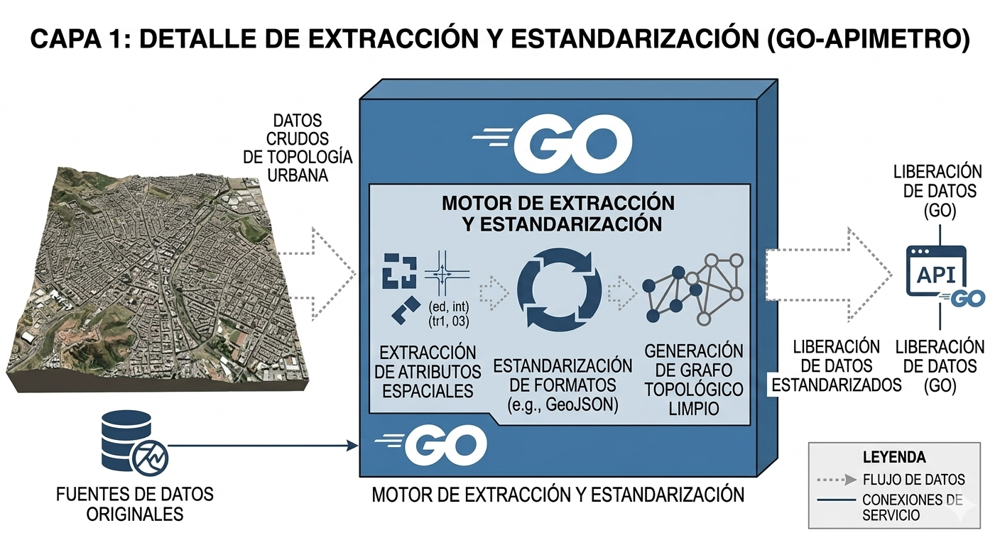
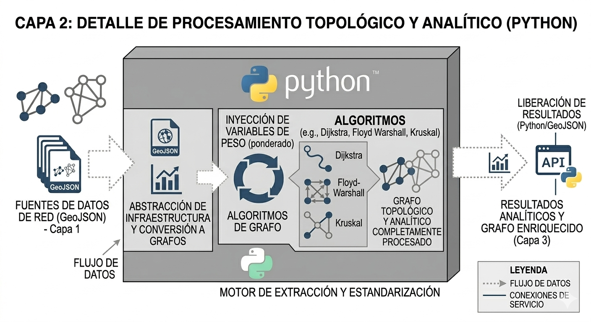
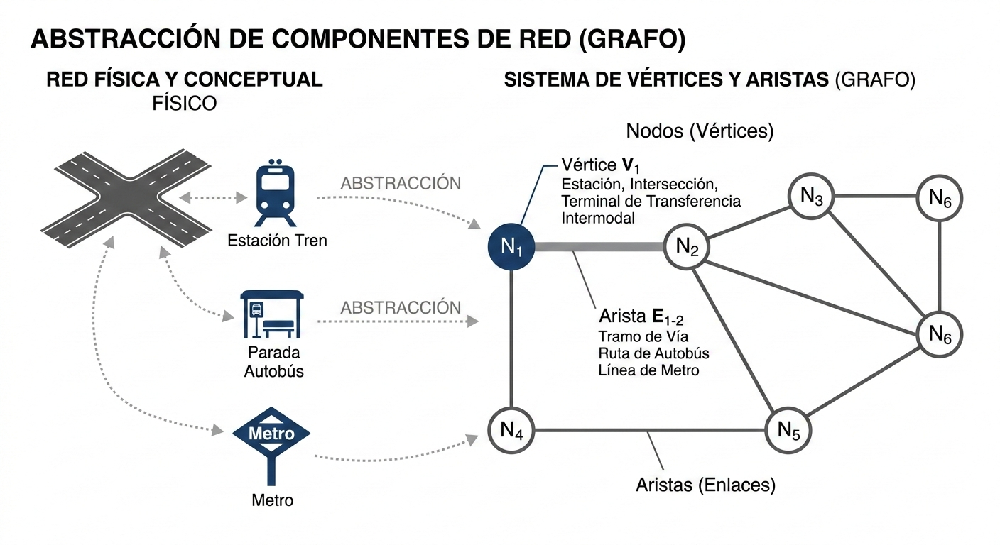

# Bienvenido al Modelo VFT (Vanishing Fig-Tree)

> **Motor analítico geoespacial y topológico para la evaluación de redes de transporte anillares y alimentadoras en la CDMX.** Documentación generada a partir de los cuadernos de investigación y validación de la tesis TAICMAM.

---

## 📖 ¿Qué es el Modelo VFT?

El **Modelo VFT (Modelo del Punto de Higuera)** es una arquitectura de software diseñada para procesar, validar y analizar matemáticamente grafos de transporte urbano masivo. Su nombre obedece a una dualidad conceptual que guía la investigación:

* **La Higuera (The Fig Tree):** Inspirado en la metáfora literaria de Sylvia Plath, el grafo de transporte representa un árbol de decisiones críticas. Si la red capilar (RTP, microbuses) no se optimiza temporal y espacialmente, las opciones convergen en la saturación sistémica.
* **El Punto de Fuga (The Vanishing Point):** Arquitectónicamente, el sistema actúa como el punto donde múltiples variables independientes (coordenadas 2D, fricción vial, capacidades) convergen en una perspectiva analítica unificada.

---

## 🏗️ Arquitectura en 3 Capas

Para transformar la geografía estática en un modelo operativo y ruteable, el sistema se divide en tres capas fundamentales. 

*(A continuación se presentan los esquemas arquitectónicos del diseño del modelo)*

### Capa 1: Adquisición y Procesamiento Geométrico
En esta fase (Hexágono de Entrada), se consumen las geometrías crudas (GeoJSON/MultiLineString) mediante la API en FastAPI. Aquí se estandarizan las coordenadas espaciales estáticas de las estaciones y trazos.

### Capa 2: Modelado Topológico y Dinámico
El núcleo matemático del sistema. Usando `NetworkX` y `scipy`, se construye el **Grafo Dirigido ($G = V, E$)**. Aquí ocurre el *Snapping Lógico* (para evitar nodos fantasma) y se inyecta la **Impedancia Temporal**, calculando el tiempo de traslado continuo castigado por la congestión.

### Capa 3: Evaluación y Salida (Indicadores)
La capa de resultados donde el grafo se somete a estrés analítico para calcular las métricas que validan el comportamiento operativo de la red.

---

## 📊 Metodología de Indicadores de Tránsito

El modelo evalúa la viabilidad y eficiencia de la red a través de tres fases de análisis progresivo:

### Fase 1: Arquitectura Base y Análisis Espacial
Indicadores puramente topológicos y geométricos:
* **Nivel de Cobertura de la Red (C):** Análisis espacial de polígonos y estaciones para medir la huella de servicio, independiente del grafo interconectado.
* **Nivel de Alimentación Capilar - Fuerza Nodal:** Cuantificación de conexiones en nodos clave (como los CETRAMs). Separa las líneas de "Masivo" y "Superficie" para validar los nodos más pesados.
* **Índice de Ruta Directa (Deuter Factor):** Contraste entre la distancia euclidiana (línea recta geométrica) y la distancia real a través de la topología de la red.

### Fase 2: Ponderación Dinámica (Realidad Operativa)
Inyección de la realidad operativa de la Ciudad de México:
* **Coeficiente de Fricción Vial ($C_f$):** Multiplicador asignado a las aristas de superficie. Permite que el modelo simule el impacto del tráfico real y los tiempos de espera, en lugar de asumir velocidades ideales constantes.

### Fase 3: Evaluación Integrada e Indicadores de Salida
Consolidación analítica del sistema completo:
* **Absorción Capilar del Anillo:** Cuantificación del volumen potencial de pasajeros que las líneas masivas (ej. Anillo Periférico) absorben desde los barrios periféricos. Demuestra matemáticamente que el anillo actúa como un "mega colector" y no como una línea aislada.
* **Evaluación de Nodos Críticos (Hubs):** Análisis práctico de alimentación en estaciones específicas (ej. cuántos microbuses alimentan a estaciones como Taxqueña) para justificar la viabilidad comercial y operativa.
---
*Usa el menú lateral para navegar por los reportes detallados de la construcción de grafos, análisis de impedancia y visualizaciones espaciales.*